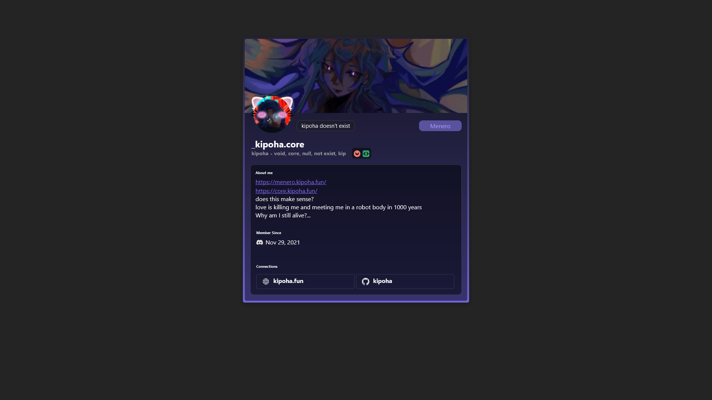

# React + Vite

edit [src/config.js](./src/config.js) as profile description, user status, pronouns and integration are static
```js
export const userId = '914930212297392129' // ur userID in discord!

export const userStatus = "kipoha doesn't exist" // user status

export const buttonName = 'Menero' // button name
export const buttonLink = 'https://menero.kipoha.fun/' // button link

export const promouns = "- void, core, null, not exist, kip" // promouns

export const aboutMe = `https://menero.kipoha.fun/
                        https://core.kipoha.fun/
                        does this make sense?
                        love is killing me and meeting me in a robot body in 1000 years
                        Why am I still alive?...` // aboutMe

export const links = [ // links
    {
        name: "kipoha.fun",
        src: site,
        link: "https://kipoha.fun/"
    },
    {
        name: "kipoha",
        src: github,
        link: "https://github.com/kipoha/"
    }
]

export const badgeIcons = { //badges and path to img
    'HOUSE_BRILLIANCE': hype, 
    'ACTIVE_DEVELOPER': dev, 
};
```


## Preview
