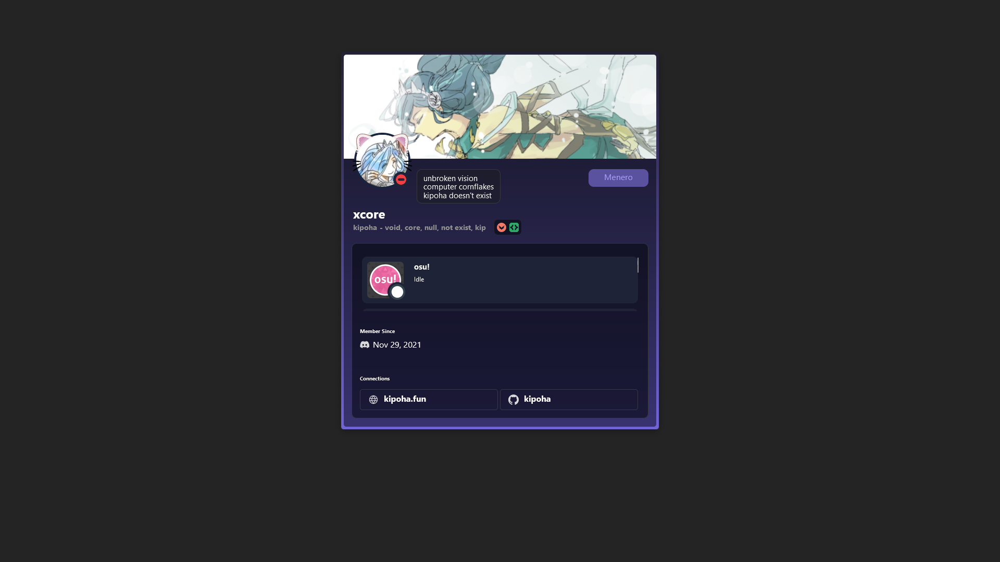

# React + Vite Profile

This project is built with **React** and **Vite**. It allows you to display your **Discord profile** including links, badges, and pronouns.

## Project Structure

- **[src/config.js](./src/config.js)** - Contains static configuration for user profile, pronouns, links, and badges.
- **[preview.png](./preview.png)** - Preview image of the app interface.
- **Lanyard Integration** - Used for fetching live Discord status, badges, and other information.

## Setup

1. Clone the repository:
    ```bash
    git clone https://github.com/kipoha/discord-profile.git
    ```

2. Navigate to the project directory:
    ```bash
    cd discord-profile
    ```

3. Install the dependencies:
    ```bash
    npm install
    ```

4. Edit the [src/config.js](./src/config.js) file to set your Discord user ID, custom button name, pronouns, and links:
    ```js
    export const userId = '914930212297392129' // Your Discord userID

    export const buttonName = 'Menero' // Button name
    export const buttonLink = 'https://menero.kipoha.fun/' // Button link

    export const pronouns = "- void, core, null, not exist, kip" // Your pronouns

    export const links = [
        {
            name: "kipoha.fun",
            src: site,
            link: "https://kipoha.fun/"
        },
        {
            name: "kipoha",
            src: github,
            link: "https://github.com/kipoha/"
        }
    ]

    export const badgeIcons = {
        'HOUSE_BRILLIANCE': hype,
        'ACTIVE_DEVELOPER': dev,
    }
    ```
5. Start the development server:
    ```bash
    npm run dev
    ```

## License

This project is licensed under the MIT License - see the LICENSE file for details.
## Preview


# Guild Integration

To fully integrate with Discord, you must join a [guild](https://discord.gg/lanyard) to use the Lanyard API.


:3 — Have fun!


### Key Points:
- Make sure to update the `userId`, `buttonName`, `buttonLink`, `pronouns`, and `links` to match your personal settings in **[config.js](./src/config.js)**.
- The **Lanyard API** requires you to join the guild for full integration with Discord status and badges.
- The preview image shows a glimpse of how the profile looks in the app.
- Instructions on setting up the project and running the development and production builds are provided.

This README should now be fully informative and ready to be used for your React + Vite project.
